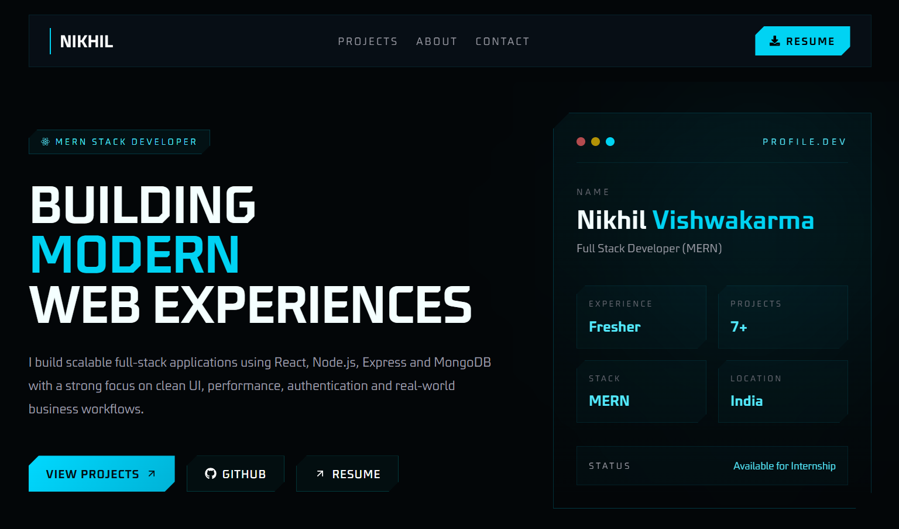
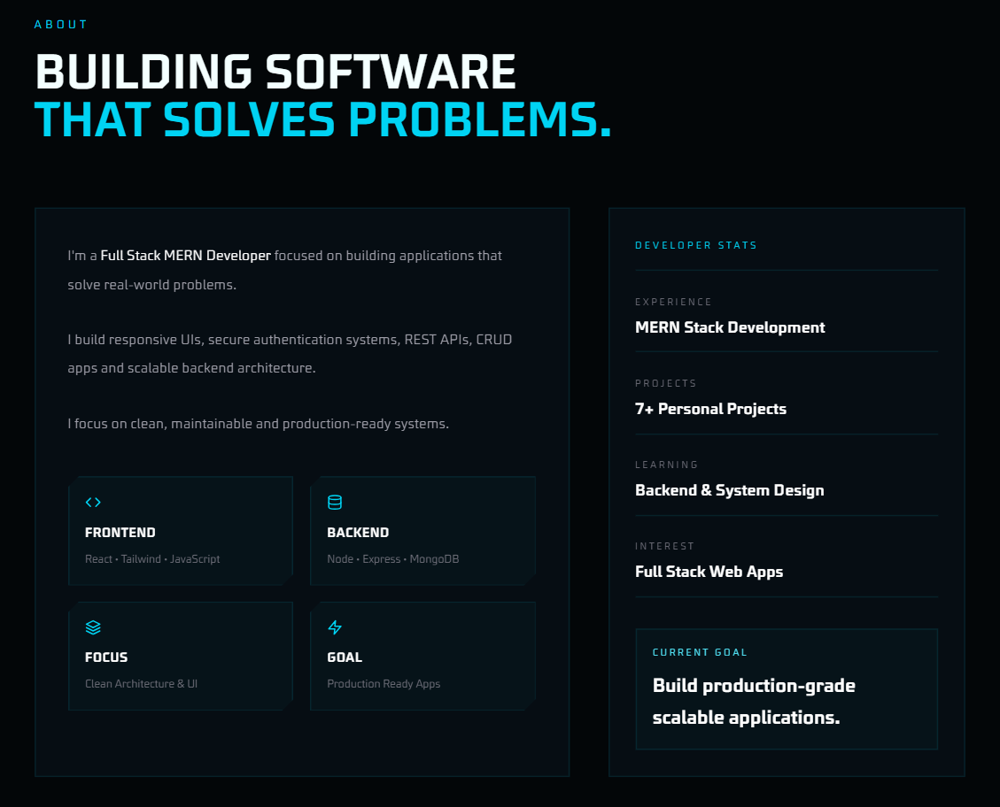
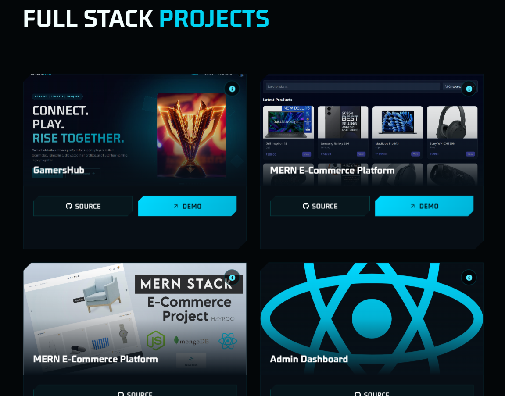
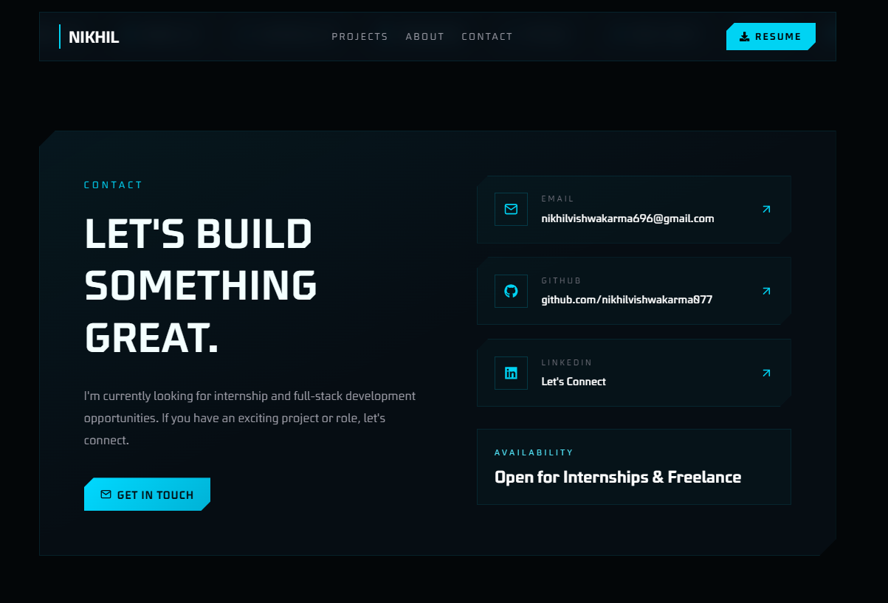

# 🚀 Nikhil Vishwakarma — Developer Portfolio

> A modern, responsive, production-ready developer portfolio built to showcase my projects, technical skills, and software engineering journey.

---

## 🌐 Live Demo

🔗 **Portfolio:** https://portfolio-nikhil077.vercel.app/

---

## 🖼️ Preview



---

## 📖 About

This portfolio serves as my central hub for showcasing software development projects, technical skills, and professional experience.

It has been designed with a strong emphasis on performance, clean UI, accessibility, responsive design, and maintainable code architecture.

The goal of this project is not only to present my work but also to demonstrate production-quality frontend development practices.

---

# ✨ Features

- Modern responsive UI
- Mobile-first design
- Dark theme
- Interactive project showcase
- Skills & technology section
- Contact section
- Resume 
- Optimized images
- Reusable React components
- Clean folder structure
- Fast Vite build
- Deployed on Vercel

---

# 🛠 Tech Stack

### Frontend

- React
- Vite
- Tailwind CSS
- JavaScript (ES6+)

### Deployment

- Vercel

### Development Tools

- Git
- GitHub
- VS Code

---

# 🏗 Architecture Overview

```
src
┣ 📂assets
┣ 📂components
┃ ┣ 📂icons
┃ ┣ 📂layout
┃ ┗ 📂project
┣ 📂data
┣ 📂pages
┣ 📜App.jsx
┣ 📜index.css
┗ 📜main.jsx

```

The application follows a component-based architecture where reusable UI components are separated from page-level components. Static project data is centralized to improve maintainability and scalability.

---

# 📸 Screenshots

## Home


---

## About



---

## Projects



---


## Contact



---

# 📄 License

This project is licensed under the MIT License.

---

# 👨‍💻 Author

Nikhil Vishwakarma

[Portfolio](https://portfolio-nikhil077.vercel.app/)

[GitHub](https://github.com/nikhilvishwakarma077)

[LinkedIn](https://www.linkedin.com/in/nikhil-vishwakarma-874776376)

nikhilvishwakarma7707@gmail.com

---

⭐ If you like this project, consider giving it a star.